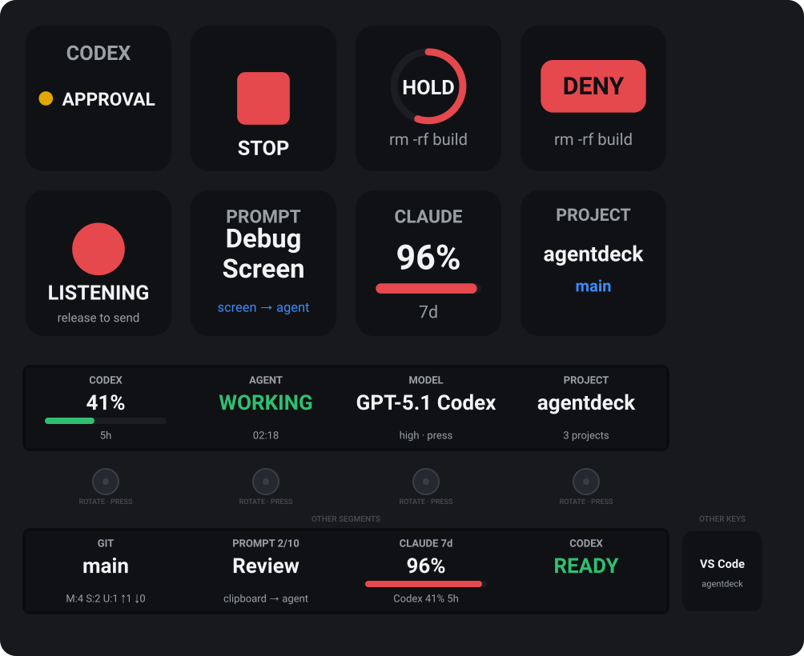
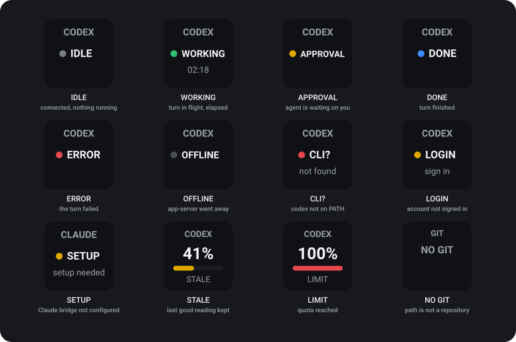

# AgentDeck for Stream Deck Plus

Monitor and control local AI coding agents from an Elgato Stream Deck +.

AgentDeck is a **controller**, not another AI client. It drives the agents you
already run — Codex and Claude Code today, others behind the same provider
interface — so the
deck answers without a context switch: what is the agent doing, how much quota is
left, what does the working tree look like, how do I answer the approval it is
waiting on, how do I say the next thing — typed, spoken or pointed at — and how
do I stop it right now.



<sub>An agent waiting on a high-risk approval, with the microphone open: the Approve key shows a hold ring mid-hold, Deny is one press, and Push-to-Talk is recording. Below the strip are the segments an encoder can be set to instead — Session shows a pinned session at <code>Plan 2/4</code>, and the AI Overview keeps providers side by side, never summed. Generated from the shipped renderers by <code>npm run preview</code>.</sub>

- **Design document (source of truth):** [`AGENTDECK_DESIGN.md`](./AGENTDECK_DESIGN.md)
- **Implementation brief:** [`docs/AGENTDECK_CLAUDE_INSTRUCTIONS.md`](./docs/AGENTDECK_CLAUDE_INSTRUCTIONS.md)
- **Current status:** [`docs/SPIKE_REPORT.md`](./docs/SPIKE_REPORT.md)

## Status

Every roadmap item through v0.4 is implemented: v0.1 Control Core, v0.2 (Claude
usage, AI Overview, Prompt Dial, Clipboard → AI), v0.3 (Push-to-Talk, Voice
Steer, Screenshot → AI) and v0.4 (Approval UI, Model / Reasoning selector, Plan
Progress, Diff Summary, Session Manager).

Everything that needs a microphone, a display or a foreground window is Windows
API work that cannot run in CI — see [Voice and screen input](#voice-and-screen-input).

| Spike             | Scope                                                           | State                |
| ----------------- | --------------------------------------------------------------- | -------------------- |
| A — Codex         | app-server lifecycle, JSON-RPC handshake, usage, turn interrupt | Verified in software |
| B — Stream Deck + | dynamic key images, encoder layout, 4-encoder coordination      | Verified in software |
| C — Git           | branch, working-tree counts, ahead/behind, non-repo handling    | Verified in software |
| D — Claude        | usage discovery, status-line bridge, parser fixtures            | Verified in software |

Codex is monitored **and** controlled; Claude is monitored only — see
[Providers](#providers) for why.

Device verification on real hardware is the one outstanding item — see
[`docs/DEVICE_TEST.md`](./docs/DEVICE_TEST.md).

## Requirements

- Windows 10 / 11 (MVP target)
- Stream Deck app 6.5+ with a Stream Deck +
- Node.js 20.5.1+
- [Codex CLI](https://github.com/openai/codex) on `PATH` (or set an override in the
  Property Inspector)
- Optional: [Claude Code](https://code.claude.com) 2.1.251+ for Claude usage — needs
  the one-line bridge in [Providers](#providers)

## Getting started

```bash
npm ci
npm run build

npx @elgato/cli link com.agentdeck.streamdeck-plus.sdPlugin
npx @elgato/cli restart com.agentdeck.streamdeck-plus
```

`npm run watch` rebuilds and restarts the plugin as you edit.

To install it somewhere without a checkout, `npm run pack` writes
`dist/com.agentdeck.streamdeck-plus.streamDeckPlugin`, which the Stream Deck app
installs on a double-click.

### Before you test on the device

```bash
npm run doctor
```

It checks, in the order things fail: Node, the built bundles, whether the Stream
Deck app can see the plugin, whether the Codex CLI is present **and completes an
`app-server` handshake** and is signed in, git, PowerShell and `System.Speech`
and a usable microphone, and whether the Claude bridge has written anything
lately.

Each line says what it disables rather than only that it failed, because the
plugin is deliberately quiet about this: a missing Codex CLI shows `CLI?` on one
key and nothing else. A failure is a blocker; a warning names a feature you may
not want. Then work through [`docs/DEVICE_TEST.md`](./docs/DEVICE_TEST.md).

## Scripts

| Script                         | Purpose                                                         |
| ------------------------------ | --------------------------------------------------------------- |
| `npm run verify`               | format check → lint → typecheck → tests → build                 |
| `npm run doctor`               | preflight: everything the plugin needs, and what is missing     |
| `npm run pack`                 | build a `.streamDeckPlugin` installer into `dist/`              |
| `npm run build`                | bundle `src/plugin.ts` into the `.sdPlugin` folder              |
| `npm run watch`                | rebuild and restart the plugin on change                        |
| `npm test`                     | unit and integration tests                                      |
| `npm run preview`              | regenerate the documentation images in `docs/images/`           |
| `npm run icons`                | regenerate the manifest PNG assets                              |
| `npm run codex:generate-types` | write official Codex protocol types into `src/generated/codex/` |

## Actions

| Action            | Controller | Behaviour                                                                          |
| ----------------- | ---------- | ---------------------------------------------------------------------------------- |
| Agent Status      | Key        | Provider, session state, elapsed turn time. Press re-reads sessions.               |
| Stop Agent        | Key        | Interrupts the active turn. Dimmed when nothing is running.                        |
| Approve Once      | Key        | Approves the waiting request. High risk must be held; see [Approvals](#approvals). |
| Deny              | Key        | Refuses the waiting request. Always one press.                                     |
| Usage             | Key        | One rate-limit window, auto or pinned. Press refreshes.                            |
| Git Status        | Key        | Branch and working-tree counts. Press refreshes.                                   |
| Project           | Key        | Shows and switches the active project. See [Projects](#projects).                  |
| App Launcher      | Key        | Starts an app in the active project. See [Launching apps](#launching-apps).        |
| Dashboard Segment | Encoder    | One touch-strip segment; four of them form a single dashboard.                     |

The default strip is `USAGE · AGENT · MODEL · PROJECT` (design §6.1). Session,
Git, Diff, Prompt, Provider health and the AI Overview are one Segment setting
away on any encoder.

## Approvals

When Codex asks to run a command or write a file, the request appears on the
Approve and Deny keys with what is being asked for and how risky it looks.

- **Approve Once, and only once.** Codex's protocol offers several ways to say
  "yes, and stop asking" — for this session, as an exec-policy amendment, as a
  network-policy rule. AgentDeck emits none of them. The mapper takes a
  two-value decision type, so a persistent approval is not something the code
  declines to send; it is something it cannot express.
- **High risk must be held.** A destructive command, a fetch piped into a shell,
  a write outside the project, or anything the deck cannot parse is high risk:
  the key shows a ring that fills as you hold it, and releasing early sends
  nothing. Everything else is a single press. The hold time is configurable
  between 0.5 and 5 seconds, and cannot be turned off.
- **Nothing answers for you.** There is no timeout and no default. The one
  exception is a disconnect: if the app-server goes away with a request still
  waiting, AgentDeck denies it rather than leaving it ambiguous.

Risk is judged from the command itself, including through the `bash -lc "…"`
wrapper Codex usually runs behind, and per command in a chain — `git add -A && rm
-rf /tmp/x` is high risk, not low. Anything that could hide a command from that
reading, such as a substitution or an unbalanced quote, is treated as high risk
rather than guessed at.

Approvals are raised by the client that owns the conversation, so AgentDeck sees
the ones for turns it starts itself. Starting turns from the deck is v0.3 work;
until then this path is exercised end to end against the app-server protocol in
tests, not yet against a turn you began on the deck.

## Prompts

A preset is a template plus where its input comes from and where the result
goes:

```ts
interface PromptPreset {
	id: string;
	name: string;
	template: string; // {{input}} is where the capture lands
	inputSource: "none" | "clipboard" | "selection" | "screenshot";
	target: "active-session" | "new-session" | "clipboard";
}
```

The deck does not get a key per prompt. Set an encoder to the **Prompt** segment
and rotating selects a preset while pressing runs it, or pin one to a Prompt key.
The same presets are what Push-to-Talk and Screenshot → AI send through, so there
is one place that decides what reaches an agent.

Edit them as JSON from the Prompt key's inspector. Invalid JSON is not saved and
your text is left alone; an empty field restores the built-in presets.

Input is captured on the press and never on a timer, and it is capped at 20,000
characters so a stray Ctrl+A cannot become a multi-megabyte prompt. Nothing that
was captured — clipboard text, a transcript, an image — is ever written to a log
line, at any level.

## Voice and screen input

**Push to Talk** records while the key is held and sends the transcript when you
release it. A recogniser that will not start — no microphone, no speech
support — is reported as a failure rather than as silence, so "nothing was
recognised" always means exactly that. Recognition is done by Windows' own recogniser on your machine:
AgentDeck sends no audio anywhere, keeps no recording, and writes neither the
audio nor the transcript to disk or to the log. The deck shows `LISTENING` for
exactly as long as the microphone is open, on the key and on the touch strip, and
releasing the key closes it — there is no toggle that can leave it recording.

**Screenshot → AI** captures the active window (or every screen) and sends it as
an image alongside the preset's prompt. The file lives in a temporary directory
that is deleted as soon as the send finishes, whether or not it succeeded.

Both are Windows-only, and both go through PowerShell because Node has no binding
for the calls they need. That work is confined to `src/adapters/desktop/`, where
the scripts take their inputs from the environment rather than by string
interpolation. **Neither has run on real hardware yet**: there is no microphone,
display or foreground window in CI, so the logic around them is tested and the
scripts themselves are not. They are on the device checklist.

## Sessions

The deck follows one session at a time — the one every "active session" key acts
on. By default that is whichever is busiest, most recently updated. Set an
encoder to the **Session** segment to take over: rotating steps through the
provider's sessions, pressing pins the highlighted one, and pressing the pinned
one again releases the pin and goes back to following the busiest.

Rotating alone changes nothing, which is the point. A dial nudged while reaching
past the deck must not silently redirect the STOP key.

A pinned session is marked with a dot in the segment's title, because "which
session am I about to stop" should never be a guess.

## Plan progress

When the agent publishes a plan, the touch strip shows how far through it is —
`WORKING · Plan 2/4`. Steps are counted, never listed: the plan itself belongs in
the agent's own UI.

Only a checklist counts. Codex's plan item carries free text, and text with no
checkboxes gets no number rather than a meaningless `Plan 0/0`. A new turn starts
from no plan, so last turn's `Plan 4/4` never sits on the key through this one.

## Diff summary

The Diff key and segment show the size of the working-tree change — `+183 -42 ·
7 files` — from `git diff --numstat HEAD`. Staged and unstaged together;
untracked files are not included, because `git diff` does not see them and the
Git key already counts those as `U:`.

A clean tree and a diff git could not read are different things and look
different: `+0 -0 · clean` against a dimmed `no diff`. Losing the diff never
costs you the branch — if `git diff` fails, the Git key still reports everything
else.

The agent's own changes are tracked separately, from the patches it applies, and
appear on the Session segment. Reading a diff belongs in the editor (design §3.5).

## Choosing a model

Set an encoder to the **Model** segment. Rotating steps through the models the
provider reports — never a hard-coded list — and each of their reasoning levels;
pressing applies the highlighted one to the active session.

Rotating alone changes nothing, and the segment says so: an unapplied choice
reads `high · press`. A provider that cannot list or apply models renders the
segment as unavailable instead of failing on press.

## Projects

A Project binds a local directory to an AI working context. It is deliberately a
separate thing from an agent session and from a provider — "which repository",
"which session" and "which agent" are three different questions (design §3.4).

Register one from the Project key's inspector, or press the key with an **Add
path** configured. After that the key cycles through what you have registered,
and switching moves everything that follows the project at once: the git key and
segment re-point, and any launcher set to start "in project" follows too.

Projects persist in Stream Deck's global settings, so they survive a restart and
are visible from every inspector.

Paths must name a drive (`C:\src\game`), a UNC share, or start at `/`. A
drive-relative path like `\src\game` is rejected on purpose: Windows calls it
absolute, but it resolves against whichever drive happens to be current, which is
not something a stored setting should depend on.

## Launching apps

The App Launcher key starts VS Code, Windows Terminal, the Codex CLI, Claude
Code, or any command you name — in the active project's directory by default.

Everything is spawned with an argument array and no shell, so a project path
containing a quote or an `&` is an argument and can never become a second
command. A key whose app is not installed renders dimmed rather than failing on
press.

## Providers

| Provider | Monitor                     | Control                                    | How it connects                                   |
| -------- | --------------------------- | ------------------------------------------ | ------------------------------------------------- |
| Codex    | usage, sessions, turn state | stop the turn, answer approvals, set model | `codex app-server --stdio`, JSON-RPC              |
| Claude   | usage, open session, model  | —                                          | Claude Code's status line, via AgentDeck's bridge |

Claude is monitoring-only, and that is a finding rather than a shortcut. Claude
Code publishes rate-limit percentages, but exposes no local usage cache to poll,
no CLI command to query, and no signal for whether a turn is currently running —
so `ClaudeProvider` implements neither `interrupt` nor `steer`, and reports its
session as idle rather than guessing. Those members are optional on the provider
port for exactly this reason, and declining them is what stops the deck offering
a STOP it cannot honour.

### Connecting Claude

Claude Code pushes; AgentDeck cannot pull. Point Claude Code's status line at
AgentDeck's bridge and it hands over the same JSON it uses to draw your own
status line:

```json
{
	"statusLine": {
		"type": "command",
		"command": "node \"%APPDATA%\\Elgato\\StreamDeck\\Plugins\\com.agentdeck.streamdeck-plus.sdPlugin\\bin\\statusline.mjs\""
	}
}
```

Already have a status line? Keep it — the bridge chains:

```json
"command": "node \"...\\bin\\statusline.mjs\" --then \"your-original-command\""
```

Your command still receives the same stdin and its output is still what Claude
Code displays. The bridge never fails loudly: malformed input, a missing
directory, or a chained command that exits non-zero all leave your status line
intact.

No credential is involved anywhere in this path. The bridge writes only what
Claude Code handed it, into `%LOCALAPPDATA%\AgentDeck\` on Windows
(`~/.agentdeck/` elsewhere) — one file per Claude Code session, so two open
terminals do not overwrite each other — and the plugin reads only that directory.
Claude Code remains the only thing that touches your Anthropic account.

One consequence worth knowing: Claude Code runs the status line only while a
session is open, so the reading goes stale once you close it. The deck says so —
a reading past its freshness window shows `STALE` over the last good number
rather than pretending to be current.

## How the deck reads

Every state is a colour and one short word. Nothing on the deck needs reading
twice, and nothing needs scrolling — long output belongs in Codex or the editor,
not here (design §3.5).



The top row is the agent's own state; the next two are everything that can go
wrong around it; the fourth is the approval pair, where the difference between
one press and a hold is the whole of the safety rule; the last covers the
microphone, and a clean tree against a diff git could not read. A provider problem outranks a stale session, so `CLI?` and
`LOGIN` replace the session state rather than sitting beside it — and a failed
refresh keeps the last good number under a `STALE` badge instead of blanking the
key.

Both images come from `npm run preview`, which runs the real `key-renderer` and
`encoder-renderer` and draws the touch strip through the same
`layouts/segment.json` the device uses, so they cannot drift from the code.

## Architecture

```text
Presentation  actions/ · presentation/
     ↓
Application   usage · session · git · project · approval · model · prompt · voice
     ↓
Domain        project · session · usage · approval · model · errors
     ↑
Infrastructure / Providers / Adapters
```

Two rules hold everywhere and are enforced by lint, not just by convention:

- **Provider isolation.** Codex and Claude wire shapes exist only inside their own
  adapter — `providers/codex/protocol.ts` and `providers/claude/status-payload.ts`
  are the boundaries, and each provider's mapper is the only translation point.
  Nothing above them can tell the two apart.
- **Dependency direction.** `domain/` and `application/` may reference a port as a
  type, but never import a concrete adapter — or the Stream Deck SDK — at runtime.

## Safety

- No `Always Approve`. Approval is once-only _by construction_: the wire mapper
  takes a two-value decision type, so Codex's session-wide and policy-amending
  variants are unreachable rather than merely unused. High-risk requests require
  hold-to-approve, and a disconnect denies whatever is still waiting.
- Credentials are read through the provider's own store; the plugin never copies
  or persists them.
- Every log line passes through a redactor. OAuth tokens, API keys, `Authorization`
  headers, full prompts and clipboard contents never reach a log file, at any
  level — including debug.
- Voice recognition is local. No audio and no transcript leaves the machine, and
  neither is written to disk or to a log.
- Captures are user-initiated. Nothing reads the clipboard, the screen or the
  microphone on a timer, and a screenshot's temporary file is deleted as soon as
  the send finishes.
- No telemetry.

## Licence

MIT — see [`LICENSE`](./LICENSE).
